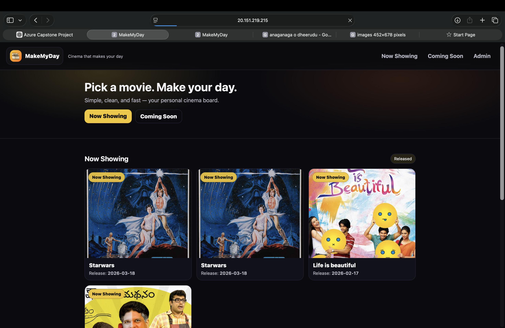
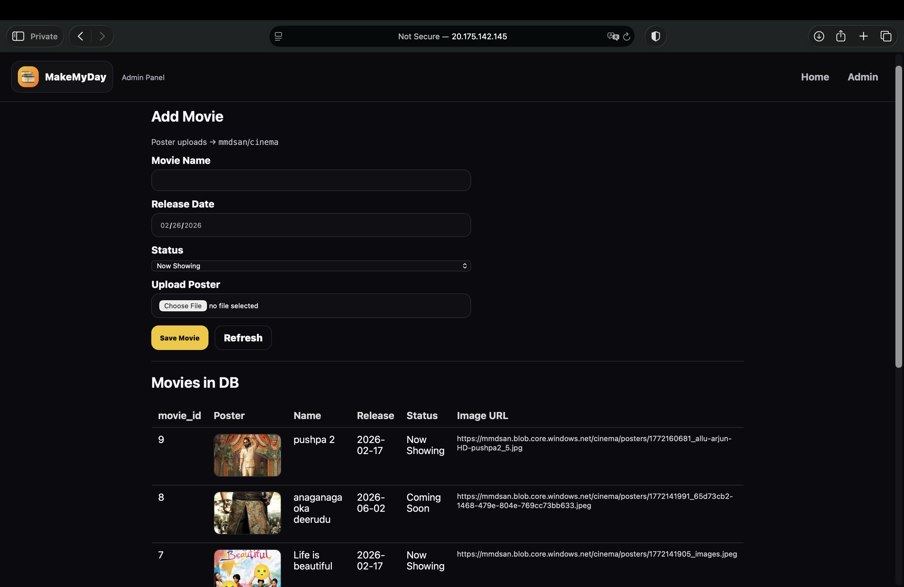
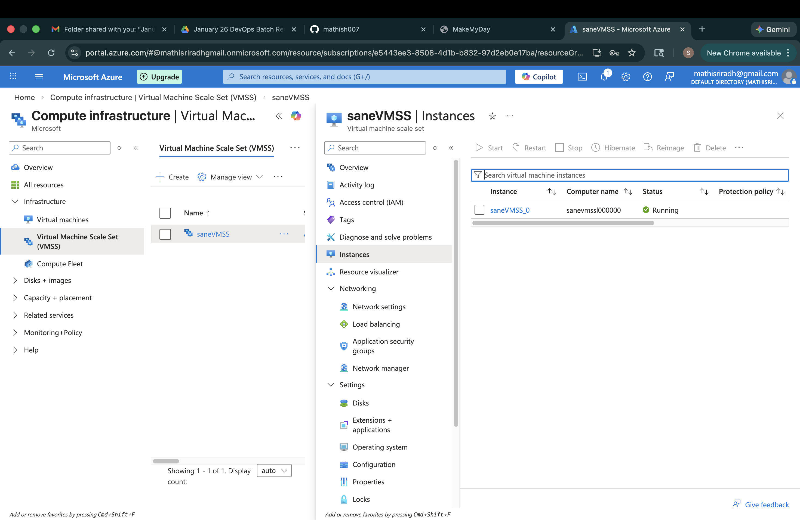

# MadeMyDay – Azure VMSS + Load Balancer Capstone (Mini Blinkit Inspired)

A 2-tier web application deployed on Azure with a **highly available web tier** using **VM Scale Sets (VMSS)** behind a **Standard Load Balancer**, plus a **private MySQL DB VM**. Images can be served either from a local folder (Phase II) or from **Azure Blob Storage** (Phase III) so the web tier becomes **stateless** and safe to scale (Phase IV).

## Architecture (High Level)

**Internet → Public IP → Standard Load Balancer → VMSS (Apache + PHP) → MySQL (Private VM) → (Optional) Azure Blob Storage (Images)**

## Features
- VMSS web tier (Uniform) behind Load Balancer with health probes
- Dynamic catalog rendered from MySQL via PHP
- Admin page to add items (and optionally upload images to Azure Blob)
- Hostname footer to verify traffic distribution across VMSS instances

## Repo Structure
```
mademyday-azure-capstone/
├── app/                    # Web app code (copy to /var/www/html)
│   ├── index.php
│   ├── admin.php
│   ├── db.php
│   ├── css/style.css
│   └── .env.example
├── scripts/
│   ├── apache-php-setup.sh
│   ├── mysql-setup.sh
│   ├── blob-php-sdk-setup.sh
│   └── harden-permissions.sh
├── infra/
│   ├── azure-cli/          # Optional CLI automation
│   │   ├── 01-network.sh
│   │   ├── 02-dbvm.sh
│   │   ├── 03-webvm-image.sh
│   │   └── 04-vmss.sh
│   └── parameters.sample.json
├── docs/
│   ├── CHANGELOG.md
│   └── troubleshooting.md
├── screenshots/            # Add your portal + website screenshots here
└── .gitignore
```

## Quick Start (Portal-first workflow)

### 1) DB VM (private) – MySQL
On DB VM (Ubuntu):
```bash
sudo bash scripts/mysql-setup.sh
```
This creates the database + table and a sample app user.

### 2) Web tier – Apache + PHP
On Web VM (Ubuntu) or your “golden image” VM before capture:
```bash
sudo bash scripts/apache-php-setup.sh
sudo bash scripts/harden-permissions.sh
```
Copy the contents of `app/` into:
- `/var/www/html/`

Update database IP + credentials in `/var/www/html/db.php` **or** use env vars (recommended).

### 3) Optional – Azure Blob for images (recommended for VMSS)
On web VM:
```bash
sudo bash scripts/blob-php-sdk-setup.sh
```
Then set the Blob config in `.env` (see `.env.example`) and use the **Blob-upload admin** behavior (already included in `admin.php`).

### 4) VMSS + Load Balancer (High Availability)
Capture a golden image from the configured web VM, then create VMSS from that image and attach to a Standard Load Balancer.

To verify load balancing, refresh the homepage multiple times and watch the hostname change in the footer.

## Environment variables
Create `/var/www/html/.env` from `.env.example` and fill values:
- `DB_HOST`, `DB_USER`, `DB_PASS`, `DB_NAME`
- Optional Blob: `BLOB_ACCOUNT_NAME`, `BLOB_ACCOUNT_KEY`, `BLOB_CONTAINER`

> Do **not** commit `.env` to GitHub.

## 📸 Screenshots

### 🏠 Homepage (Load Balanced Web Tier)


### 🎬 Coming Soon Section


### 🛠 Admin Panel


### ⚙️ VM Scale Set Instances


---

## License
MIT (optional). Add one if you want public reuse.
